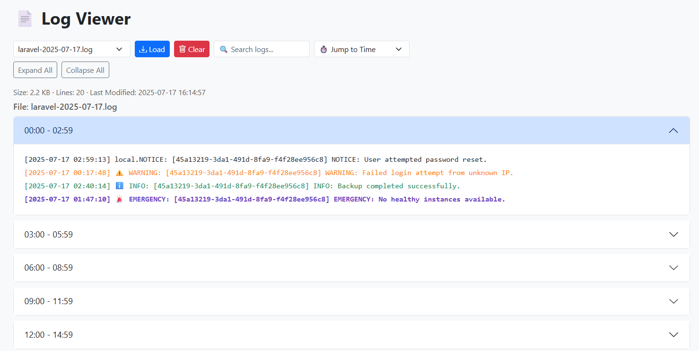

# Laravel LogViewer Lite

A lightweight, beautifully designed log viewer built with Laravel.  
Easily browse, filter, and manage your application logs directly from your browser.

---

## 🧩 Problem Statement

Modern Laravel applications generate logs for everything — from database failures and system errors to user activity and debugging. While Laravel provides robust logging under the hood, viewing these logs is still a developer-unfriendly experience:

- Logs are stored as plain text in deep file paths (`storage/logs`), making them hard to discover.
- Searching for specific entries or errors requires opening huge log files manually.
- There's no native way to view logs with formatting, color, or level-based filtering.
- Tools like Laravel Telescope are too heavy or opinionated for many use cases.
- CLI tools aren't always accessible for non-developer team members.

---

## 💡 Our Solution: Laravel LogViewer Lite

Laravel LogViewer Lite fills this gap by providing a clean, simple, and production-friendly browser interface to view and manage logs. It's:

- ✅ Lightweight and dependency-free (zero config)
- ✅ Easy to plug into any Laravel project
- ✅ Developer and non-tech friendly
- ✅ Customizable and visually categorized by log level

<p align="center">
  
</p>

---

## 🚀 Features

- 📂 Browse logs by date
- 🔍 Search/filter logs by keyword
- 🧠 Highlighted log levels (info, warning, error, debug, etc.)
- ⏱ Jump to specific time blocks
- ➕ Expand/Collapse all log groups
- 🧪 Test data generator for development
- 🧹 Clear logs with a single click

---

## 📸 Screenshots

<p align="center">
  
  <br><em>A glance at the LogViewer Lite interface</em>
</p>

---

## ⚙️ Requirements

- PHP 8.1+
- Laravel 10+
- Bootstrap 5 (via CDN)
- Tailwind (used selectively for layout compatibility)
- File-based logging enabled (`storage/logs/laravel-*.log`)

---

## 📦 Installation

```bash
git clone https://github.com/meghrajs/laravel-logviewer-lite.git
cd laravel-logviewer-lite
composer install
cp .env.example .env
php artisan key:generate
php artisan serve
```

✅ Important: Enable Daily Log Files
To ensure logs are written to separate files for each day (e.g., laravel-2025-07-17.log), make sure your .env file contains:
```bash
LOG_CHANNEL=daily
```

## 🔧 Usage
- Visit /log-viewer to browse logs
- Use /test-log to generate fake logs for testing
- Use /clear-logs (POST) to clean current log file

## 🤝 Contributing
Pull requests are welcome. Please open an issue first for major changes or ideas.
You can contribute by:

- Reporting bugs
- Suggesting features
- Improving UI/UX
- Writing tests

## 📄 License
This project is open-sourced under the MIT License.

## 👨‍💻 Author
Built with ❤️ by Meghraj Singh
